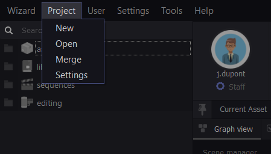
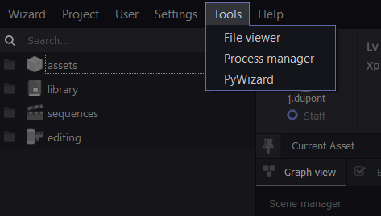
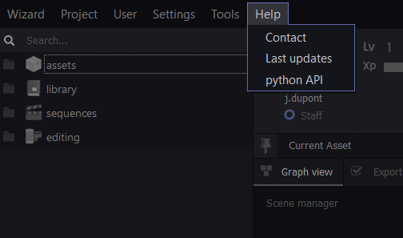
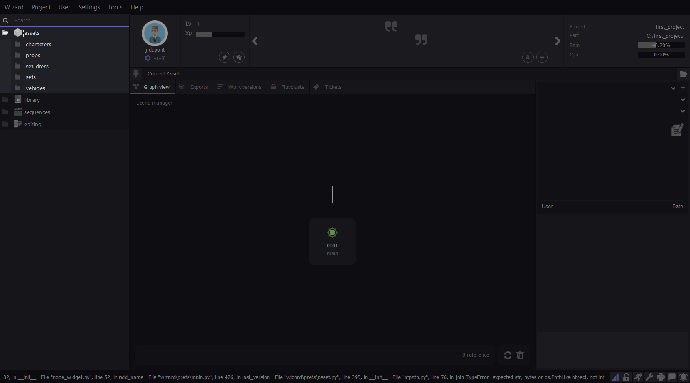
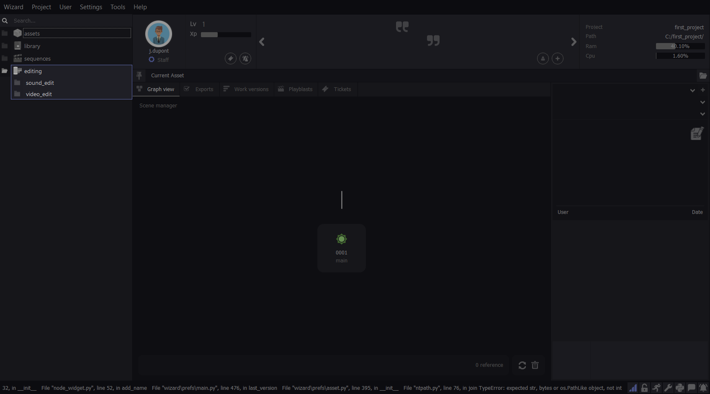
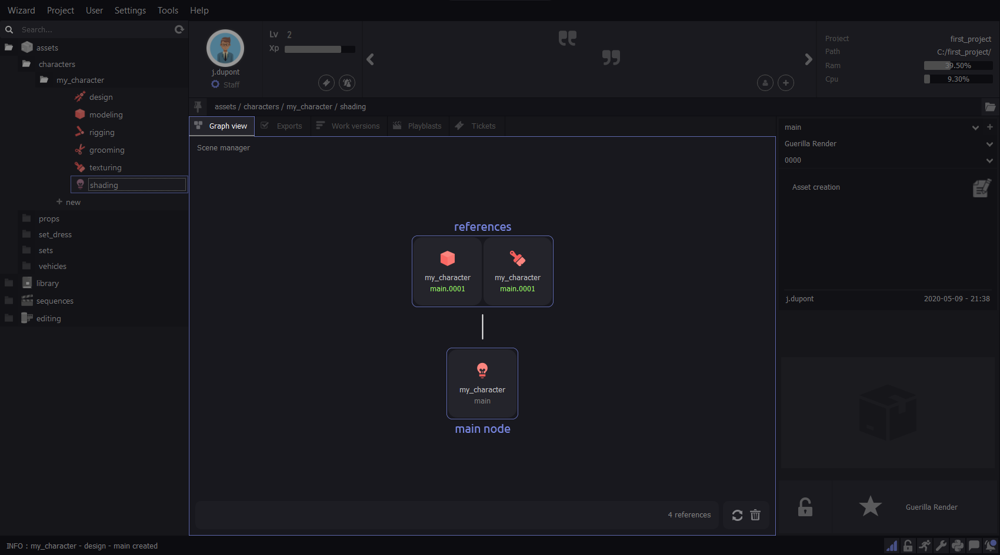
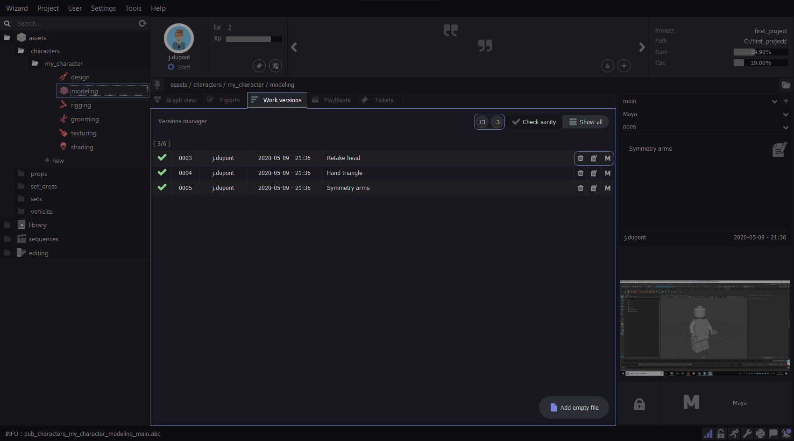
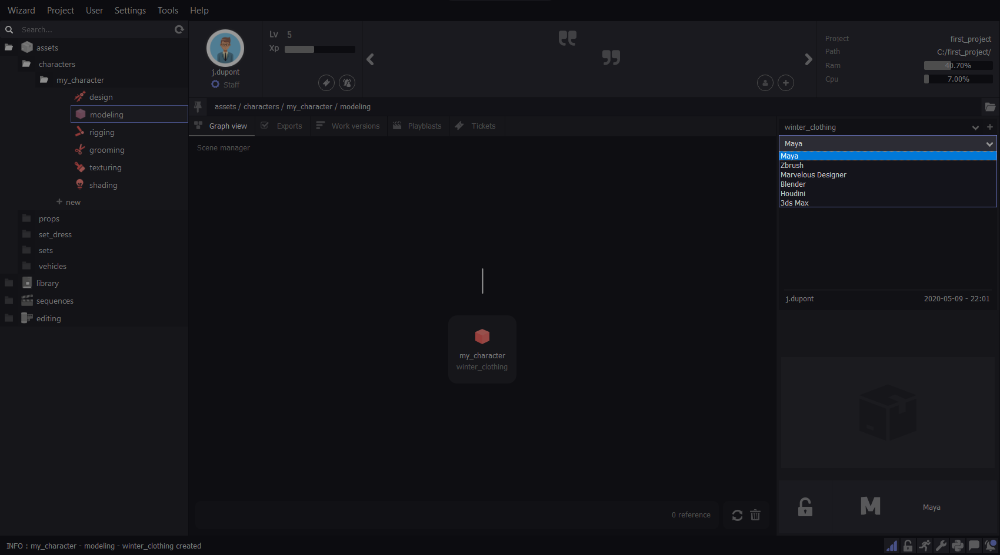
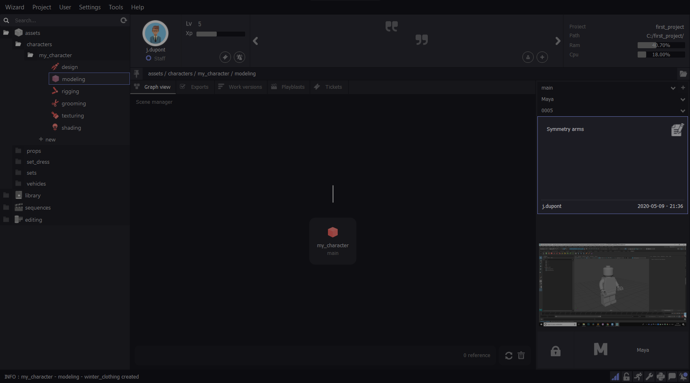

^^^^^^^^
Overview
^^^^^^^^

Menu
====

Wizard
^^^^^^

The “About” tab of the Wizard menu contains the Version and the Wizard License information.
Access the Wizard - Pipeline Manager project hosted by Github

.. image:: _images/overview_menu_1.png
  :width: 300
  :alt: Alternative text

Project
^^^^^^^
	
The “Project” tab allows you to manage your projects. Create, open, change, and configure all your projects from this menu.

User
^^^^
	
The “User” tab allows you to manage registered users in wizard. Create, change, and set your password from this menu.

Settings
^^^^^^^^

The “Settings” tab allows you to set each software to your liking: add the path of the “.exe”, environment variables and scripts via “Softwares”.

.. image:: _images/overview_menu_4.png
  :width: 300
  :alt: Alternative text

Customize the interface and the various features of the UI Wizard from “Settings” tab of the settings menu. These settings are user preferences and project-independent.

Tools
^^^^^

Viewer : Wizard adapts its UI according to the preference files generated when the user create an asset, publish an asset, etc... These files are created automatically when you work and are only available for reading and editing in the “Viewer” tool. 

.. danger::
	Modifying these files can corrupt a whole part of your pipeline, it’s strongly recommended to edit them only with full knowledge.

Subprocess manager : The Subprocess Manager is a tool that isolates and relocates some wizard tasks. It allows you to keep using Wizard while it performs long and incompressible operations like publish and map conversation, playblast or animation export.

PyWizard : Access subprocess application programming interface.

.. note::
  To use Pywizard, refer to the API documentation.

Help
^^^^

In this tab, access to the Wizard updates, documentation and python API. In case of problems, write to the technical support from “Contact”.

Outliner
========

The Outliner allows you to create and archive assets and stages.
The outliner is connected to your project. It contains and lists all the scenes and allows you to intuitively access on every file of your project. Each user connected to the project will access to the outliner and its functions. The search function saves if your project contains a large volume of assets.

.. image:: _images/overview_outliner_1.png
  :width: 800
  :alt: Alternative text

Assets
^^^^^^

The “Asset” block of the Outliner contains all your assets. Divided into four categories: Characters, Vehicles, Set, Set Dress.
Each Asset contains a specific list of stages. They represent the fabrication process of the asset: Design, Modeling, Rigging, Grooming, Texturing, Shading.

Library
^^^^^^^

The “Library” block contains specific and recurring assets of your project. Camera Rig, Auto Rig, Scripts, Gizmo, Shaders, etc... all available and referenceable in your scenes once created and published.

.. image:: _images/overview_outliner_3.png
  :width: 800
  :alt: Alternative text

Sequence
^^^^^^^^

The “Sequence” block contains all your animated scenes, from concept stages to lighting. Create a technical or definitive sequence, set the name and number of images of each shot.

Editing
^^^^^^^

The “Editing” block is divided into two categories: Videos and Sound. As the previous bloc, it gives an access to your post production scenes.

Scene 
=====

Pin Asset
^^^^^^^^^

Use the pin icon to lock temporari ly your scene. It allows you to drag and drop multiple published asset from the outliner to reference them in the scene. The scene will be highlighted in blue when pinned.

Node Graph
^^^^^^^^^^

The Node Graph is a nodal representation of the content of your work scene. Your work file is represented by a node relative to the stage to which it corresponds. This is the main node of the Graph Node, separated from the other nodes. If your file is a modeling file, it will be represented by a modeling node, etc...
The other nodes represents the references in your scene.

Exports
^^^^^^^

The “Exports” tab lists all the export history of your scene. You can open or comment any export using the icons on the right side.

Work versions
^^^^^^^^^^^^^

The “Work Version” tab shows the Version Manager. It lists all the versions history of your scene. It shows the last 3 work versions ( you can display more or less by clicking on the +3/-3 icons), the user who created it and the comment. You can delete, comment or open any version using the icons on the right side.

Playblast
^^^^^^^^^

The “Playblast” tab lists all playblast history. It shows the last 3 versions of playblast ( you can display more or less by clicking on the +3/-3 icons), the user who created it and the comment. You can delete, comment or open any version using the icons on the right side.

Tickets
^^^^^^^

The “Ticket” tab allows you to open a ticket on an asset. A ticket is a note that reveals a problem and justifies a retake. Click on the "Open new ticket" button to create a new ticket. Choose the user concerned, or all the user connected to the project and create the ticket. Once opened on the asset, the concerned user(s) will receive a notification: the ticket will remain open until a user close it.

.. note::
  You can filter the display of ticket the two button on the upper right corner of the ticket tab. It will show you only your ticket(s) or the opened ticket(s).

Launcher
========

The Launcher is the area where you select the variant and version of an asset and then the software you are working with. This is also where you access the comments and screenshot of your scenes.

.. image:: _images/overview_launcher_0.png
  :width: 800
  :alt: Alternative text

Variants
^^^^^^^^

By default, each asset is created on a variant called “main”. This is the asset in its main variant. Variants are each of the differences represented by a replica or a copy of the main asset in its main variant.
The variants of an asset simplify the integration of these differences in the pipeline of the concerned asset. You can create as many variants as the asset requires for your project. 
For example, variants are used in case of clothing changes for a character. This example therefore implies a variant of the asset in the modeling, texturing, rig and shading stages to integrate these differences into your project. Another variant example: If the texturing of your asset changes, a variant in the texturing stage is necessary.

Softwares
^^^^^^^^^

The “softwares” part of the launcher allows you to choose the software you want to use to work on the selected asset’s stage.

Version
^^^^^^^

The version of the asset (not to be confused with the variant of an asset) is the backup history of your asset. By default, an asset is created in version 0000, each backup increments this numbers as follows: 0001, 0002, 0003 etc... 
A list containing these versions is available in selection in this part of the launcher and allows you to open any working version of your asset.

.. image:: _images/overview_launcher_3.png
  :width: 800
  :alt: Alternative text

Comment
^^^^^^^

The comment section of the Launcher allows you to comment each working version. Version comments are very useful for the fabrication history of an asset. They are even more useful during a version back-up to know on which version you want to perform this back-up. Use the comments to document the history of your asset. Write in the text field and click the comment icon to post your comment.

Screenshot
^^^^^^^^^^

The screenshot of your work scene is done when you save your asset in the software. It allows to display an image of the scene and helps visualise your asset without opening it.

.. note::
  Click on the screenshot to display it full size.

.. image:: _images/overview_launcher_6.png
  :width: 800
  :alt: Alternative text

Locker
^^^^^^

The locker is a function that locks an asset automatically when it is opened from Wizard. This function aims to secure the working scene so that each file is edited by one user at a time.

Once your work is complete, the asset remains locked and therefore unavailable to the rest of your team. Remember to unlock it by clicking on the locker icon. 

.. note::
  If you are looking to unlock a working scene locked by an absent user that can’t do it itself, you can right click on the locker icon and select “send unlock request”. This function sends a code per email to the user who locked the scene. Get the code from this user and write it in the text box provided for this purpose so that wizard unlocks the scene. This process ensures that the user who owns the lock allows you access to the file.

.. image:: _images/overview_launcher_10.png
  :width: 800
  :alt: Alternative text

Launcher
^^^^^^^^

The Launcher allows you to open your work scenes, it’s the only way to open your software and recover the Wizard tools that will allow it to integrate your work into the pipeline. The launcher opens the variant and its selected version, with the selected software.

.. image:: _images/overview_launcher_11.png
  :width: 800
  :alt: Alternative text

User infos
==========

It’s here in the UI that you will find information about your user. Your photo, your level, your Xps.
Xps is earned by the work done from Wizard. Levels are earned from Xps. 
This is also where the administrator/staff status is mentioned, if you declared yourself as administrator when you created your user.
You can also consult the tickets that are sent to you and the notifications you are sending.

.. image:: _images/overview_user_infos.png
  :width: 300
  :alt: Alternative text

.. note::
  Clic on your profil picture to modify it.

Quotes & Jokes
==============

This part of the Wizard UI allows users to add text that will be displayed randomly. Click the “+” button and add your message. You can also rate from 1 to 5 stars all messages except yours .

.. image:: _images/overview_jokes.png
  :width: 300
  :alt: Alternative text

Project & Machine infos
=======================

This part shows you which project is connected to Wizard as well as its location.
It also shows the performance of your machine in real time.

Extras
======

More tools are available from the icons at the bottom right of the Wizard interface.

Notification Wall
^^^^^^^^^^^^^^^^^

The Notifications Wall allows you to have an overview of your project history through notifications. You can filter and display only “Create”, “Publish” and “Remove” notifications.

.. image:: _images/overview_extras_2.png
  :width: 800
  :alt: Alternative text

Chat
^^^^

The chat is an internal communication system hosted on the Wizard server. It allows to communicate in real time with users connected to the project. You can also use it to send images to your team.

.. image:: _images/overview_extras_3.png
  :width: 800
  :alt: Alternative text

Log & Python Console 
^^^^^^^^^^^^^^^^^^^^

The Wizard log print every command processing by Wizard. You can find it at the bottom left corner of the UI.

.. image:: _images/overview_extras_8.png
  :width: 800
  :alt: Alternative text

The Wizard python console allows you to execute python commands. You can also have a look of the log here.

 

.. note::
  If any error occurs while using Wizard, click the mail icon on the console to send the Error Log to the Wizard support team.

.. note::
  While emailing the Wizard support you will received an automatic mail back. It mentioned that your message was successfully delivered and that the technical team is dealing with the problem.

Settings 
^^^^^^^^

This icon open the Wizard UI setting that allows you to customize it. Turn off and change the notification sound, change the theme of the UI and many more.

.. image:: _images/overview_extras_9.png
  :width: 800
  :alt: Alternative text

Locked Asset
^^^^^^^^^^^^

This button allows you to see the number of assets locked by your user and unlock them directly with one click. To allow other users to open any work scene of the project in your absence, it’s strongly recommended to unlock your assets through this button, before quitting your Wizard session.

Running Asset
^^^^^^^^^^^^^

This button allows you to see the number of assets in work if you have multiples opened scenes.

.. image:: _images/overview_extras_5.png
  :width: 800
  :alt: Alternative text

Server  
^^^^^^

Wizard is automaticaly running a server when you launch it. This icon is blue while Wizard is connected to the server. The server allows to connect multiple user to a project, access to their working files and communicate with them.

